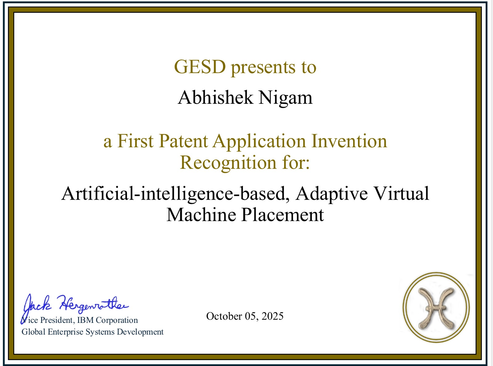

# AI-Driven Adaptive Virtual Machine Placement
### U.S. Patent Application No. 19-350188

This repository documents my filed U.S. patent titled: “AI-Driven Adaptive Virtual Machine Placement Utilizing RBO, PPO, and GNN Algorithms for Cloud Optimization.”

**Overview**

This invention proposes an AI-based system for intelligent virtual machine (VM) placement in cloud environments.
The solution leverages:

Reinforcement learning (PPO)

Graph Neural Networks (GNN)

Rule-Based Optimization (RBO)

to dynamically optimize VM allocation, resource utilization, and workload distribution in large-scale cloud infrastructures.

**Inspiration**

The idea was conceptualized while working on cloud provisioning and real-time workload visualization features, where inefficiencies in VM placement directly impacted performance, scalability, and user experience.

**Impact**

Improved cloud resource optimization

Reduced over-provisioning and infrastructure waste

Enhanced real-time provisioning decisions

Scalable AI-driven orchestration framework

## 📄 Patent Certificate

