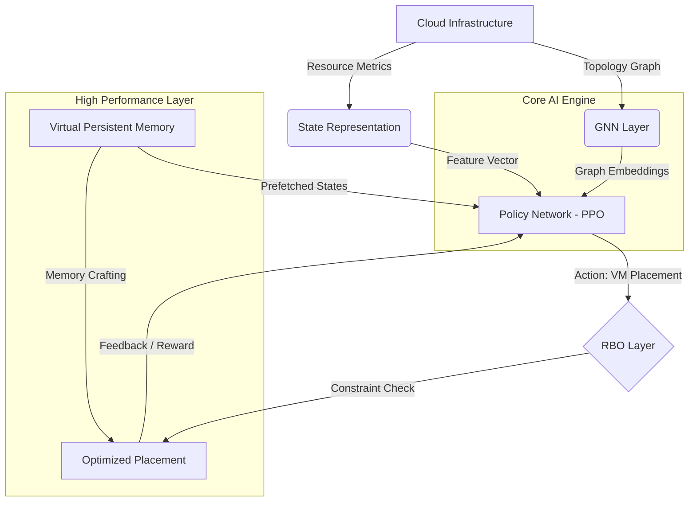
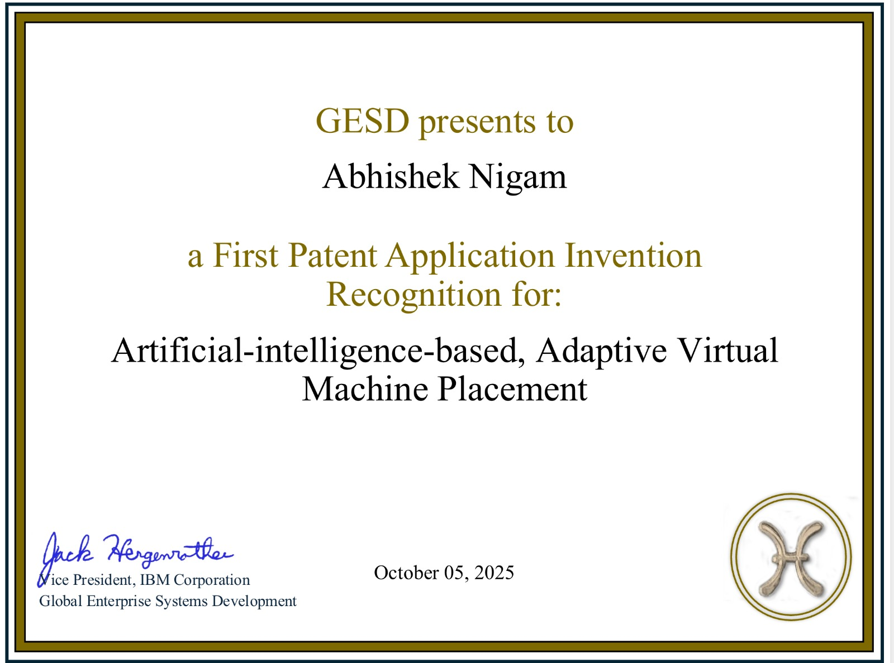

# AI-Driven Adaptive Virtual Machine Placement 🌩️🤖
### Utilizing GNN, PPO, and RBO for Cloud Optimization
**U.S. Patent Application No. 19-350188**

---

**An advanced AI-driven system for intelligent VM placement in large-scale cloud infrastructures. This solution leverages a hybrid Graph-RL architecture to optimize resource utilization, with a specific focus on high-performance memory management using Virtual Persistent Memory (vPMem).**

> [!NOTE]
> This patent has been officially **Filed** in the U.S. Patent Office. As it was filed through a corporate entity, it may take additional time to appear in public databases like Google Patents.

---

## 🌟 The Challenge: Cloud Resource Management

Managing virtual machine (VM) placement in modern, large-scale cloud environments is a high-dimensional optimization problem. Traditional heuristic-based methods (like First-Fit or Best-Fit) fail to:
- **Model Topology**: Heuristics ignore the complex graph-like relationships between microservices and network nodes.
- **Adapt Dynamically**: Static rules fail under non-stationary, real-time workload fluctuations.
- **Avoid Latency**: Fetching memory states from disk causes significant overhead in high-performance computing.

## 🛠️ The Solution: Hybrid AI Architecture & vPMem

This patent proposes a unified framework that combines the spatial power of **GNNs**, the adaptive decision-making of **PPO-RL**, and the performance of **Virtual Persistent Memory (vPMem)**.

### 📐 Architecture Overview

```mermaid
graph TD
    A[Cloud Infrastructure] -->|Topology Graph| B(GNN Layer)
    A -->|Resource Metrics| C(State Representation)
    B -->|Graph Embeddings| D[Policy Network - PPO]
    C -->|Feature Vector| D
    D -->|Action: VM Placement| E{RBO Layer}
    E -->|Constraint Check| F[Optimized Placement]
    F -->|Feedback / Reward| D
    
    subgraph "Core AI Engine"
    B
    D
    end
    
    subgraph "High Performance Layer"
    vP[Virtual Persistent Memory] -->|Prefetched States| D
    vP -->|Memory Crafting| F
    end
```

### 🧠 Key Innovations

- **Virtual Persistent Memory (vPMem)**: Memory is "crafted" directly from VM resources rather than being fetched from the disk. This drastically reduces I/O wait times and improves the full-stack responsiveness of the orchestrator.
- **Graph-Aware PPO**: The Reinforcement Learning agent (PPO) is fed graph embeddings from a GNN, allowing it to "understand" the network topology before making placement decisions.
- **Intelligent Caching**: Advanced caching ensures that the most relevant VM states are always ready in the vPMem tier, bypassing traditional storage bottlenecks.

---

## 📜 Patent Certificate

<b>Click to View Patent Original Certificate</b>

 

---

## 🤝 Contact

**Aryan 972** - AI & Cloud Research  
*Feel free to reach out for collaboration or inquiries regarding the patent's implementation.*

---

  Generated with ❤️ for the AI-Adaptive Cloud Community

